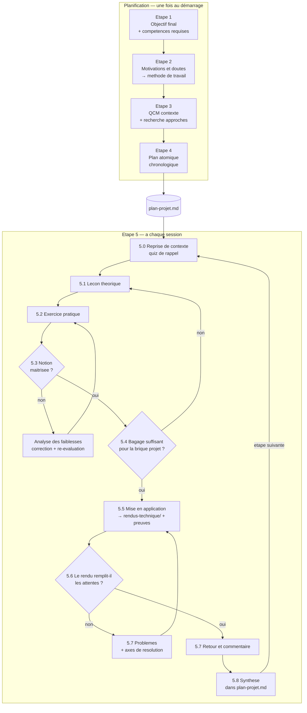

# Workflow d'apprentissage — setup Pi

Harnais d'apprentissage par projet pour [Pi](https://pi.dev). Tu définis un objectif réel,
le Chef de projet en déduit un plan chronologique, et un Enseignant te fait traverser ce
plan notion par notion — leçon, exercice, mise en application dans le vrai projet, revue.

Implémentation directe du workflow en 5 étapes. Tout se passe en français.

## Démarrer

```bash
git clone https://github.com/18nelli18/PiLearn.git
```
```bash
cd PiLearn && mv -r pi .pi
```
```bash
tmux new -A -s pi 'pi'
```

`tmux` est nécessaire pour les sous-agents (`pi-interactive-subagents` les lance dans des
panneaux séparés). Sans lui, tout fonctionne quand même : le Chef de projet lit les
fichiers d'agent et joue les rôles lui-même, en séquence au lieu d'en parallèle.

Au premier lancement, Pi demande d'**approuver le projet** — c'est ce qui active `.pi/`.
Réponds oui, sinon ni les skills ni les agents ne se chargent.

Puis :

```
/nouveau-projet
```

## Les commandes

| Commande | Quand |
|---|---|
| `/nouveau-projet [objectif]` | Démarrer — cadrage complet, étapes 1 à 4, jusqu'à `plan-projet.md` |
| `/cours <N-slug>` · `/cours-ou` · `/cours-off` | Piloter la trace écrite (voir plus bas) |
| `/apprendre [étape]` | Lancer ou reprendre une session — la boucle de l'étape 5 |
| `/rendu [étape]` | Soumettre une réalisation à la revue |
| `/reviser [notion]` | Session de révision espacée, sans avancer dans le plan |
| `/ou-en-suis-je` | Point d'avancement complet, sans démarrer de leçon |
| `/bilan` | Clôturer la session — synthèse, journal, file de révision |
| `/replanifier [quoi]` | Ajuster le plan quand une étape est mal calibrée |

## Le workflow



## Les rôles

| Rôle | Où | Ce qu'il fait |
|---|---|---|
| **Chef de projet** | la session principale (`AGENTS.md`) | Déroule les étapes 1 à 4, écrit et tient `plan-projet.md`, délègue l'étape 5, garde la cohérence exercices ↔ objectif, dit ce qui manque |
| **Enseignant** | `.pi/agents/enseignant.md` | Fait la leçon et l'exercice. Contextualise, explique, interroge, corrige. S'appuie sur des ressources humaines et les cite |
| **Créateur de diagramme** | `.pi/agents/createur-de-diagramme.md` | Produit le diagramme Mermaid ou SVG qui rend une notion visible |
| **Fact-checker** | `.pi/agents/fact-checker.md` | Vérifie les affirmations techniques par recherche sourcée, avant qu'elles n'entrent dans une leçon |
| **Code Reviewer** | `.pi/agents/code-reviewer.md` | Confronte le rendu aux critères de réussite et remonte les erreurs à l'Enseignant |

Les trois derniers sont autonomes et tournent en parallèle. L'Enseignant est interactif :
tu lui parles directement dans son panneau tmux.

## Les fichiers

| Fichier | Rôle | Qui écrit |
|---|---|---|
| `plan-projet.md` | Plan chronologique **et** état d'avancement — la source de vérité | Chef de projet |
| `profil-apprenant.md` | Objectif, motivations, risques d'abandon, méthode de travail | Chef de projet (étape 2) |
| `journal.md` | Log des sessions + file de révision espacée | Chef de projet (5.8) |
| `rendus-technique/<N>-<slug>/` | Ce que tu produis, avec les preuves de fonctionnement | **toi** |
| `cours/<N>-<slug>/cours.md` | Le cours rédigé au fil de la leçon | Enseignant |
| `cours/<N>-<slug>/transcript.md` | Trace brute et automatique de la session | extension `cours-log` |
| `ressources/notions/` | Une fiche par notion maîtrisée — ta base de connaissances | Enseignant |
| `ressources/diagrammes/` | Sources `.mmd` / `.svg` et images rendues | Créateur de diagramme |
| `templates/` | Gabarits imposés à tout fichier généré | personne |

## La trace écrite

Une leçon qui n'existe que dans le scrollback du terminal est perdue. Chaque apprentissage
laisse donc **trois** niveaux de trace, du plus court au plus complet :

| Fichier | Longueur | Pour quoi |
|---|---|---|
| `ressources/notions/<notion>.md` | 1 page | Réviser — l'essentiel et le piège |
| `cours/<N-slug>/cours.md` | quelques pages | Reprendre la leçon en entier |
| `cours/<N-slug>/transcript.md` | tout | Retrouver une phrase exacte |

**`cours.md`** est écrit par l'Enseignant **pendant** la leçon, section par section : la
contextualisation, chaque idée avec le raisonnement qui l'a fait découvrir, les diagrammes,
les sources, les questions de contrôle **avec tes réponses**, l'énoncé de l'exercice, tes
tentatives et la correction. Une session coupée en plein milieu laisse quand même sur le
disque tout ce qui a été vu.

**`transcript.md`** est le filet : l'extension `.pi/extensions/cours-log.ts` recopie la
session en direct — tes messages, la prose de l'agent, les questions/réponses — en écartant
le bruit d'outillage (bash, read, write…). L'enregistrement démarre seul ; quand
l'Enseignant sait sur quelle étape il travaille, il appelle l'outil `cours_log` et la trace
est rapatriée dans le bon dossier, sans perdre ce qui précède.

Tu n'as normalement rien à faire. Si besoin : `/cours <N-slug>` pour rediriger, `/cours-ou`
pour savoir où ça écrit, `/cours-off` pour couper.

## Les règles du jeu

Elles s'appliquent à tous les agents, et c'est ce qui fait la différence avec un chatbot :

1. **Personne n'écrit ton code.** Ni l'Enseignant, ni le Chef de projet, ni le Reviewer.
   Tu obtiens des indices, du pseudo-code, une ligne pointée — jamais la solution.
2. **Rien n'est affirmé sans vérification.** Versions, comportements d'API, chiffres :
   ça passe par le fact-checker avant d'être dit.
3. **Tout est sourcé.** Doc officielle, spécification, auteur — avec le lien, pour que tu
   puisses aller lire l'original.
4. **La compréhension est vérifiée en cours de route**, pas à la fin. Une question toutes
   les 2-3 idées neuves.
5. **Pas de compliment automatique.** « C'est juste » ou « non, voilà où ça casse ».
6. **Pas de progression sur un doute.** Une notion non maîtrisée reboucle sur un nouvel
   exercice. Deux échecs de suite, c'est le plan qu'on corrige, pas toi qu'on pousse.
7. **Sans preuve de fonctionnement, pas de revue.**
8. **Tout apprentissage laisse une trace écrite.** Une leçon sans `cours.md` rempli n'est
   pas terminée.

## Outils requis

Tout est déjà installé sur cette machine.

| Paquet | Rôle dans ce workflow | Requis |
|---|---|---|
| [`pi-interactive-subagents`](https://github.com/HazAT/pi-interactive-subagents) | Lance l'Enseignant, le Fact-checker, le Reviewer, le Créateur de diagramme | fortement recommandé |
| [`@juicesharp/rpiv-ask-user-question`](https://www.npmjs.com/package/@juicesharp/rpiv-ask-user-question) | QCM de l'étape 3, questions de compréhension, quiz de rappel | fortement recommandé |
| [`pi-web-access`](https://www.npmjs.com/package/pi-web-access) | `web_search`, `source_check`, `fetch_content` pour le Fact-checker | requis |
| `.pi/extensions/cours-log.ts` | Transcript automatique des sessions — fourni ici, rien à installer | inclus |
| `tmux` | Panneaux des sous-agents | requis pour le multi-agent |
| Node.js + `npx` | Rendu des diagrammes Mermaid en PNG/SVG (`@mermaid-js/mermaid-cli`, téléchargé au premier appel) | optionnel |
| [`pi-atelier`](https://www.npmjs.com/package/pi-atelier) | Barre d'état, suivi de contexte et de session | confort |
| [`@deevus/pi-wayfinder`](https://www.npmjs.com/package/@deevus/pi-wayfinder) | Lecture et édition de code précises pour le Reviewer | confort |

Réinstallation sur une autre machine :

```bash
pi install npm:pi-web-access npm:@juicesharp/rpiv-ask-user-question git:github.com/HazAT/pi-interactive-subagents
```

## Personnaliser

**Les modèles** — un par fichier d'agent, en frontmatter `model:`. Actuellement réglés sur
le provider `cliproxyapi` :

| Agent | Modèle |
|---|---|
| `enseignant` | `cliproxyapi/claude-opus-4-6-thinking` (thinking `medium`) |
| `code-reviewer` | `cliproxyapi/claude-opus-4-6-thinking` (thinking `medium`) |
| `fact-checker` | `cliproxyapi/claude-sonnet-4-6` |
| `createur-de-diagramme` | `cliproxyapi/claude-sonnet-4-6` |

`pi --list-models` donne les identifiants disponibles.

**La pédagogie** — chaque skill de `.pi/skills/` est un fichier Markdown éditable. Si
l'Enseignant fait trop de théorie, la règle est dans `lecon-theorique/SKILL.md`.

**Les outils des agents** — attention au piège : le champ `tools:` d'un agent devient
`pi --tools`, qui filtre **aussi les outils d'extension**, pas seulement les outils natifs.
Un `tools: read, write` suffit à priver le fact-checker de `web_search`. Si tu restreins,
liste explicitement les outils d'extension nécessaires ; sinon, omets le champ pour tout
autoriser (c'est le choix fait pour l'Enseignant, qui a besoin de `ask_user_question`).

Le champ `system-prompt: append` est présent sur les quatre agents : sans lui, le contenu
du fichier d'agent est injecté dans un simple message utilisateur au lieu du prompt système,
et le rôle tient beaucoup moins bien.

**Le rythme** — `profil-apprenant.md`, rempli à l'étape 2 et relu par l'Enseignant à chaque
session. C'est le levier le plus efficace : durée des sessions, délai avant indice,
équilibre théorie/pratique.

## Arborescence

```
ProjectLearning/
├── AGENTS.md                       ← rôle du Chef de projet, chargé à chaque démarrage
├── .pi/
│   ├── settings.json
│   ├── agents/                     ← enseignant, fact-checker, créateur de diagramme, reviewer
│   ├── skills/                     ← cadrage-projet, plan-apprentissage, session-apprentissage,
│   │                                 leçon-théorique, exercice-pratique, revue-de-rendu,
│   │                                 vérification-factuelle, visualiser
│   ├── extensions/                 ← cours-log.ts, le transcript automatique
│   └── prompts/                    ← les commandes slash
├── templates/                      ← gabarits plan, cours, fiche, rendu, revue, journal
├── cours/                          ← un dossier par étape : cours.md + transcript.md
├── rendus-technique/               ← ce que tu produis
├── ressources/
│   ├── notions/                    ← ta base de connaissances
│   └── diagrammes/
├── plan-projet.md                  ← généré par /nouveau-projet
├── profil-apprenant.md             ← généré à l'étape 2
└── journal.md                      ← généré à la première clôture
```

Un seul projet d'apprentissage actif à la fois. Pour en démarrer un autre, archive
`plan-projet.md` (`/nouveau-projet` le propose) ou duplique tout le dossier.
