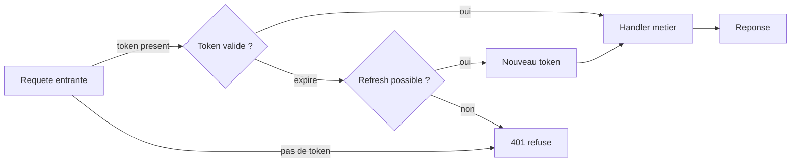

# Visualiser

Un diagramme sert à faire comprendre **une** chose qui résiste au texte. S'il ne fait que
récapituler ce qui vient d'être dit, il ajoute du travail au lecteur au lieu d'en retirer.

## La question préalable

Avant d'écrire la moindre ligne : **qu'est-ce que le lecteur ne comprend pas encore, et que
ce dessin doit faire comprendre ?**

Écris la réponse en une phrase. Si tu n'y arrives pas, il n'y a pas de diagramme à faire —
dis-le et passe à autre chose. Cette phrase servira de légende.

## Faut-il un diagramme ?

**Oui** quand la notion comporte :

| Contenu | Forme |
|---|---|
| Enchaînement d'étapes, branchements, boucles | `flowchart` |
| Échanges entre composants dans le temps | `sequenceDiagram` |
| États d'un objet et transitions | `stateDiagram-v2` |
| Entités et relations, structure de données | `classDiagram` / `erDiagram` |
| Chronologie, jalons, durées | `gantt` |
| Disposition spatiale, mémoire, anatomie d'un format, couches superposées | **SVG à la main** |

**Non** pour une définition, une convention de nommage, une liste, une comparaison à deux
colonnes (un tableau fait mieux), ou de la décoration.

**Mermaid par défaut** — versionnable, lisible en diff, modifiable par l'apprenant.
**SVG** quand la *position* des éléments porte l'information : un layout automatique la
détruirait.

## Écrire

Fichier : `ressources/diagrammes/<etape>-<notion>.mmd` (ou `.svg`).

Textes en français ; identifiants techniques en anglais s'ils correspondent au code réel du
projet.

### Règles de lisibilité

- **12 nœuds maximum.** Au-delà, tu illustres deux idées : découpe, ou abstrais un
  sous-ensemble en un seul nœud.
- **Les flèches portent un label** quand la relation n'est pas évidente : `-->|si valide|`,
  pas `-->` tout nu.
- **Trois ou quatre mots par nœud.** Le reste va dans la légende.
- **Le vocabulaire est celui de la leçon et du code.** Un diagramme avec son propre
  vocabulaire ajoute une couche à décoder.
- **La couleur porte du sens ou n'existe pas.** Une couleur = une catégorie, expliquée en
  légende. Ne dépends jamais de la seule couleur pour distinguer deux choses : ajoute une
  forme ou un label.
- **Un sens de lecture clair** — de haut en bas (`flowchart TD`) ou de gauche à droite
  (`LR`), pas les deux.

## Rendre

Deux canaux, complémentaires — fais **les deux** :

### 1. En ligne, dans la conversation

Pi rend les blocs Mermaid directement dans le terminal (réglage `markdown.mermaid`,
`streaming` par défaut). Colle le diagramme dans ta réponse dans un bloc ` ```mermaid ` :
l'apprenant le voit immédiatement, sans ouvrir de fichier. **C'est le canal principal
pendant une leçon.**

### 2. En image sur disque, pour la base de connaissances

```bash
.pi/skills/visualiser/scripts/rendre-diagramme.sh ressources/diagrammes/<fichier>
```

Le script rend les `.mmd` en `.svg` + `.png` dans `ressources/diagrammes/rendus/` via
`mermaid-cli` (téléchargé à la volée par `npx` au premier appel — prévoir un délai), copie
les `.svg` tels quels, et ouvre le résultat. Options : `--no-open`, `--png-seul`,
`--theme <nom>`.

C'est cette image que les fiches `ressources/notions/` référencent — elle survit à la
session.

## Vérifier — ne saute pas cette étape

Du Mermaid syntaxiquement valide produit très régulièrement un rendu illisible :
chevauchements, labels tronqués, flèches croisées, nœuds écrasés.

1. `read` sur l'image produite (`.png` de préférence — tu la vois telle que l'apprenant la
   verra).
2. Contrôle : tout le texte est-il lisible ? les flèches sont-elles suivables ? le sens de
   lecture est-il évident sans explication ?
3. Corrige et re-rends jusqu'à ce que ce soit propre.

Corrections courantes : passer de `TD` à `LR` (ou l'inverse), raccourcir les labels,
regrouper dans un `subgraph`, ou retirer des nœuds.

## Livrer

Retourne au demandeur, dans cet ordre :

1. Le chemin du fichier source (`.mmd` / `.svg`) — l'apprenant peut le modifier.
2. Le chemin de l'image (`.png` / `.svg`).
3. **La phrase préalable** : ce que ce diagramme fait comprendre.
4. **2 à 4 lignes de légende** à lire avec le schéma : ce que représentent les formes, les
   couleurs, et le chemin à suivre des yeux.

Un diagramme livré sans sa légende est livré à moitié.

## Exemple



> **Ce que ça fait comprendre :** un token expiré n'est pas un token invalide — les deux
> chemins divergent avant le refus.
> Losanges = décisions. Le chemin nominal est en haut, les sorties d'erreur convergent
> toutes vers `401 refuse`.
